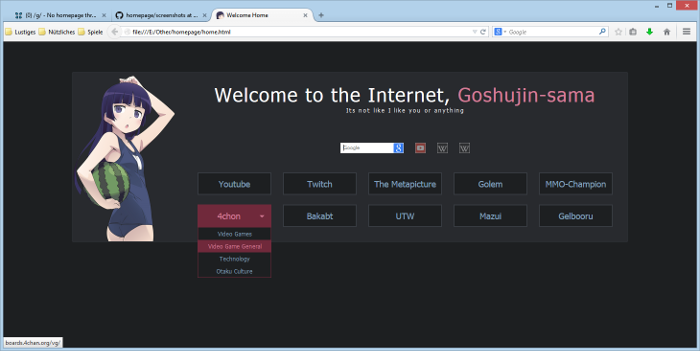

Homepage
====



**Live Demo: [Dark](http://gokoururi.github.io/homepage/) - [Light](http://gokoururi.github.io/homepage/index-light.html)**

This repository contains a custom homepage made using html, css and javascript (jQuery). Feel free to download and modify. Comments and suggestions appreciated. Please don't expect too much.

Features:
* Flashy links
* Flashy Slidy sublinks
* Flashy Slidy searchbars
* Randomly selected cute 2D girls
* Column style links.
* **New**: Light color theme. See [Live Demo](http://gokoururi.github.io/homepage/index-light.html)
  * New directory structure for easier making and sharing themes.

Customizing, adding mascots and themes
----
To change current theme, replace its name in [home.html](home.html#L15-17)

To customize mascots in `ruri-dark` theme, modify the array in [themes/ruri-dark/mascots.js](themes/ruri-dark/mascots.js):
```javascript
var mascotList = [ "ruri1.png", "ruri2.png", "ruri3.png" ];
```

To make new theme, you can copy an existing one, and change images and [colors.css](themes/ruri-dark/colors.css) as you like.  
Please note that entries in your theme's [mascots.js](themes/ruri-dark/mascots.js) should match with contents of [mascots/](themes/ruri-dark/mascots/) directory.  
(Of course, above links use `ruri-dark` theme only as an example.)

Disclaimer
----
Images of cute girls were made by Anons from /w/ and stolen from their [Google Drive](https://drive.google.com/folderview?id=0B_VmbVyD4eT3N1VUbGN4Wjd5OVE).
